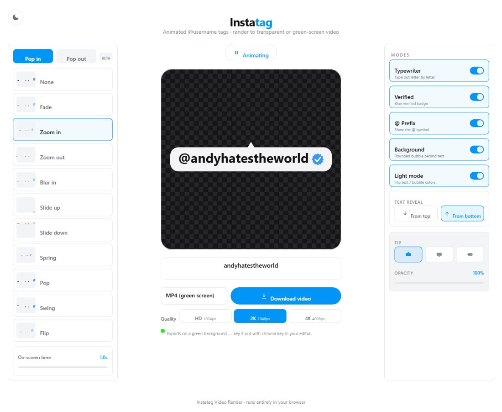

# Instatag Video Render

A fully local, client-side **animated @username tag generator**. Type a username,
pick an entrance/exit animation, toggle modes (verified badge, @ prefix, typewriter,
background bubble, dark tag) and **render** the looping result to a **green-screen MP4**
(for chroma keying), a **transparent GIF**, or a **transparent PNG**.

Runs entirely in the browser — no backend, no accounts, nothing uploaded anywhere.



## Features

- 11 entrance/exit animations (Fade, Zoom, Blur, Slide, Spring, Pop, Swing, Flip, …)
- Verified badge, `@` prefix, typewriter, background bubble (tip + opacity), dark tag
- Per-letter typewriter cascade with a soft luminescent glow, and a choosable
  reveal direction (letters fall in from the top or rise from the bottom)
- Auto-fit: long usernames scale to always stay inside the frame
- Render to **MP4 (green screen)**, **GIF**, or **PNG** at HD / 2K / 4K
- Light UI by default with an optional dark theme toggle
- 100% in-browser — the live preview and the export share one render pipeline,
  so what you see is exactly what gets rendered

## Stack

- **Next.js (App Router)** + **React** + **TypeScript**
- **Tailwind CSS** — clean, airy light design system (blue accent, thin borders, no shadows)
- **Framer Motion** for the live previews in the animation list
- **Canvas API + MediaRecorder** for green-screen MP4 (WebM fallback), **gif.js** for GIF,
  and a single-frame **PNG** export

The preview canvas is transparent; the checkerboard is a CSS layer behind it, so it
never ends up in the exported file.

## Run locally

**Windows — easiest:** double-click **`start.bat`**. It installs dependencies the
first time (if needed), starts the dev server, and opens the browser for you.

**Any platform — manual:**

```bash
npm install
npm run dev
```

Then open http://localhost:3000.

No environment variables, API keys, or external services are required.
`npm install` runs a small postinstall step that copies `gif.js`'s web worker
into `/public/gif.worker.js` for client-side GIF rendering.

## Project structure

```
app/
  layout.tsx        # root layout + metadata
  page.tsx          # three-column layout, app state, theme toggle
  globals.css       # Tailwind + theme variables + checkerboard + sliders
components/
  AnimationList.tsx # Pop in/out tabs, effect cards, on-screen-time slider
  MiniPreview.tsx   # Framer Motion live preview per effect
  PreviewCanvas.tsx # main transparent canvas (shared render loop)
  ModesPanel.tsx    # MODES toggles + reveal direction
  TipControl.tsx    # bubble tip shape (up / down / none)
  ExportButton.tsx  # format + quality + download
  ThemeToggle.tsx   # interface light/dark toggle
  VerifiedBadge.tsx # verified seal (SVG, for DOM previews)
lib/
  animations.ts     # central animation config (canvas frames + FM variants) + loop timing
  compose.ts        # state + time -> RenderOptions (incl. text reveal)
  tagRenderer.ts    # canvas drawing (text, badge, bubble, transforms)
  export.ts         # MP4 / GIF / PNG exporters
  types.ts          # shared types + defaults
```

## Notes

- **Timing:** the entrance is fast and fixed. The "On-screen time" slider controls
  how long the finished tag stays visible before the loop repeats. In Typewriter
  mode the typing duration scales with the username length so the cascade is visible.
- **MP4 (green screen)** is the recommended export — the tag renders over a solid
  `#00ff00` background so you can drop it on a timeline and remove the green with a
  **chroma key** effect in any editor. If the browser can't record MP4 it falls back
  to WebM (still green).
- **4K video:** browser encoders can't encode 4096² video, so MP4 is rendered at
  ~2.5K. **GIF/PNG export the full 4K.**
- **GIF** keeps real transparency but only 1-bit (a green key color), so soft edges
  may show a slight fringe. It is capped to 720px for performance.
- **PNG** exports the fully-revealed frame, transparent, at the selected quality.

## License

[MIT](LICENSE) © 2026 Andy
